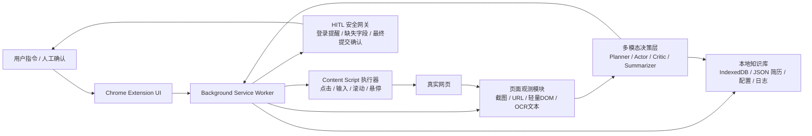

# 网页多模态 Agent 开题报告

## 1. 课题名称

基于浏览器原生插件与多模态大模型的网页 Agent 设计与实现

## 2. 任务定义与应用背景

### 2.1 任务定义

本课题面向“网页多模态 Agent：界面理解 + 自动操作”这一方向，拟实现一个运行在 Chrome 浏览器中的 Web Agent。系统接收自然语言指令，以网页截图、页面文本和用户本地知识库为输入，在真实网页环境中完成如下三类任务：

1. 登录后信息收集：在需要登录的网站中完成搜索、浏览、筛选和摘要整理。
2. 跨站表单填写：根据本地知识库自动填充问卷、简历或申请表，并在缺失字段与提交节点进行人机协同确认。
3. 开放网页信息汇编：在多个公开网站中自动导航、检索目标信息并生成结构化对比结果。

简言之，本项目要解决的是“让 Agent 像人一样看网页、理解界面并执行操作”，而不是依赖固定 DOM 规则编写易碎脚本。

### 2.2 应用背景

当前大量办公与信息获取任务依赖网页完成，如校招网申、学校官网信息检索、旅游与租房信息整理、问卷填报、跨平台资料采集等。这些任务具有三个共同特点：

1. 页面结构高度异构，DOM 字段和元素命名不统一。
2. 真实网页经常存在弹窗、悬浮菜单、登录态、延迟加载等复杂交互。
3. 高风险操作需要用户保留最终控制权，不能完全黑盒自动执行。

现有基于 `Selenium`、`Playwright` 的脚本自动化虽然可操作网页，但对页面改版和交互变化极为敏感，且在登录态继承、反自动化检测、安全确认方面不足。多模态大模型的发展为“基于视觉理解的网页智能体”提供了新可能，因此本课题具有明显的研究价值与应用价值。

## 3. 现有方案评估与完善

你们原方案的核心方向是对的，尤其有三点很强：

1. 以浏览器原生插件为载体，天然复用真实登录态与浏览器环境。
2. 以视觉感知为主线，避免强依赖 DOM 选择器，泛化性更好。
3. 引入 HITL，人机协同边界清晰，适合课程作业展示“可用且可控”。

但为了更适合作为开题与答辩方案，建议做以下四点完善：

### 3.1 从“全能 Agent”收缩为“课程可交付 Agent”

原方案场景较多，若全部深做，工程风险偏高。建议把目标拆成：

1. 主场景：开放网页多站点信息检索与汇总。
2. 辅场景：简历/问卷表单半自动填写。
3. 演示场景：登录网站检测与人工接管，不强求全自动跨登录墙执行。

这样既保留创新点，也能控制实现难度。

### 3.2 从“纯视觉”升级为“视觉为主，轻量 DOM 为辅”

原文强调完全摒弃 DOM，这是一个很强的研究立场，但工程上并不总是最优。更合理的方案是：

1. 感知主通道使用截图 + VLM，保证跨站泛化。
2. 执行层允许读取少量稳定信号，如输入框类型、可点击元素边界框、页面标题、URL、焦点元素。
3. 不依赖站点私有 CSS Selector，不做深度 DOM 规则工程。

这样可以显著降低坐标点击误差，也更容易在课程演示中稳定成功。

### 3.3 加入“任务状态机”和“失败恢复”

原方案已有 Planner、Critic、Summarizer，但还缺一个显式状态机。建议增加以下状态：

`INIT -> OBSERVE -> PLAN -> ACT -> VERIFY -> RECOVER/HITL -> DONE`

并增加三类恢复策略：

1. 点击失败后重截图并重新定位。
2. 页面跳转异常时回退到上一状态。
3. 连续失败超过阈值后切换 HITL。

这会让系统更像一个“可复现实验系统”，而不只是一个概念原型。

### 3.4 明确评测对象与基线

建议课程答辩时不要只展示“能跑”，还要展示“为什么这个设计比简单脚本更合理”。推荐至少设置三类对照：

1. 规则脚本基线：固定 XPath/CSS 的半自动脚本。
2. 文本基线：仅使用页面文本或 OCR 文本，不看整页视觉布局。
3. 你们的方法：视觉主导 + 轻量 DOM 辅助 + HITL。

## 4. 相关工作调研

下面列出与本课题最相关、且适合作为报告中代表性工作的 6 项论文/项目。

### 4.1 Mind2Web: Towards a Generalist Agent for the Web

- 作者：Xiang Deng 等
- 年份：2023
- 链接：[OpenReview](https://openreview.net/forum?id=kiYqbO3wqw)
- 贡献：提出真实网站环境下的通用 Web Agent 数据集，覆盖 137 个网站、2000+ 开放任务。
- 启发：适合为你们的“跨站泛化”与“真实网页任务”提供 benchmark 依据。
- 局限：以网页结构信息为核心，视觉交互能力不是主要亮点。

### 4.2 WebVoyager: Building an End-to-End Web Agent with Large Multimodal Models

- 作者：Hongliang He 等
- 年份：2024
- 链接：[arXiv 2401.13919](https://arxiv.org/abs/2401.13919)
- 贡献：提出端到端多模态 Web Agent，在真实网站上进行视觉驱动交互与自动评测。
- 启发：证明“截图 + 动作循环”路线可行，是你们方案最直接的研究对标。
- 局限：以研究原型为主，现实部署中的登录态、安全控制与工程落地讨论较少。

### 4.3 SeeAct / GPT-4V(ision) is a Generalist Web Agent, if Grounded

- 作者：Boyuan Zheng 等
- 年份：2024
- 链接：[OpenReview](https://openreview.net/forum?id=ndcVUVgcHS)
- 贡献：系统讨论了大模型在网页环境中的视觉理解与 grounding 问题。
- 启发：说明“会理解任务”不等于“能准确落点执行”， grounding 是核心瓶颈。
- 局限：仍需要额外 grounding 策略，说明单纯模型能力不足以支撑稳定执行。

### 4.4 AppAgent: Multimodal Agents as Smartphone Users

- 作者：Chi Zhang 等
- 年份：2023 预印本，2025 CHI
- 链接：[arXiv 2312.13771](https://arxiv.org/abs/2312.13771)
- 贡献：将多模态 Agent 拓展到手机 GUI 场景，以点击、滑动等人类操作方式完成任务。
- 启发：虽然平台是手机，但“视觉 GUI Agent + 动作空间简化 + 经验记忆”的思想可直接迁移到网页场景。
- 局限：针对 App 而非浏览器，网页中的多标签页、长文档和复杂表单问题覆盖较少。

### 4.5 The BrowserGym Ecosystem for Web Agent Research

- 作者：Thibault Le Sellier de Chezelles 等
- 年份：2024
- 链接：[arXiv 2412.05467](https://arxiv.org/abs/2412.05467)
- 贡献：提出统一的 Web Agent 评测生态，强调标准化动作空间、观测空间与实验管理。
- 启发：为你们的实验设计、日志记录与误差分析提供了方法论支持。
- 局限：更偏评测基础设施，不直接提供工程落地方案。

### 4.6 OSWorld: Benchmarking Multimodal Agents for Open-Ended Tasks in Real Computer Environments

- 作者：Xiaohui Xie 等
- 年份：2024
- 链接：[arXiv 2404.07972](https://arxiv.org/abs/2404.07972)
- 贡献：在开放电脑环境中评估多模态 Agent，系统总结点击误差、状态漂移、环境噪声等常见失败模式。
- 启发：可为你们分析网页 Agent 失败类型提供更一般的 GUI 智能体视角。
- 局限：任务空间更宽，不专门针对网页优化。

### 4.7 与本项目的差异化定位

与上述工作相比，本项目更强调以下工程特性：

1. 浏览器原生插件部署，而非独立自动化驱动。
2. 面向真实课程作业场景的可演示性与稳定性。
3. 把 HITL 作为系统核心而不是补充功能。
4. 重点支持“信息整理”和“表单填写”两类高价值网页任务。

## 5. 系统方案设计

### 5.1 总体设计思路

本系统采用“浏览器插件执行层 + 多模态决策层 + 本地知识记忆层”的架构。整体原则是：

1. 用浏览器插件承接真实网页交互与状态继承。
2. 用多模态模型完成页面理解、动作规划和结果总结。
3. 用本地知识库存储用户资料和执行日志。
4. 用状态机和 HITL 保证任务可控、可恢复、可解释。

### 5.2 系统架构图

### 5.3 模块划分

#### 5.3.1 感知模块

输入包括：

1. 当前视口截图。
2. 当前页面 URL、标题。
3. 轻量 DOM 信息，如可交互元素边界框、输入框类型、按钮文本。
4. 必要时的 OCR 文本。

输出为页面状态描述与候选可操作元素集合。

#### 5.3.2 决策模块

决策模块由统一的大模型服务承担，可按 Prompt 角色化为四个子功能：

1. `Planner`：将用户任务拆成若干操作步骤。
2. `Actor`：基于页面观测输出具体动作。
3. `Critic`：判断动作是否成功，是否需重试、回退或切换 HITL。
4. `Summarizer`：将抓取结果整理为结构化输出。

#### 5.3.3 执行模块

通过 `Content Script` 在网页上下文中执行：

1. 点击、输入、滚动、悬停。
2. 读取表单控件值和元素可见性。
3. 注入高亮框、状态条和确认弹窗。

#### 5.3.4 记忆模块

存储内容包括：

1. 用户简历或问卷资料 JSON。
2. 常见字段别名映射表。
3. 任务执行日志与失败案例。
4. 用户偏好设置，如默认学校、默认邮箱、是否自动滚动等。

### 5.4 关键技术路线

#### 5.4.1 视觉主导的页面 grounding

采用截图作为主要输入，以真实视口而非长截图作为感知单元，减少视觉 hallucination 和坐标失准。

#### 5.4.2 轻量 DOM 辅助定位

不依赖站点专属 Selector，但读取通用交互信号提升稳定性，如：

1. 输入框边界框。
2. 按钮文本与可见状态。
3. 当前聚焦元素。

#### 5.4.3 Semantic Form Memory

将简历/问卷资料标准化为 JSON，并构建字段别名，如：

- `毕业院校`
- `本科院校`
- `学校`
- `最高学历学校`

统一映射到标准槽位，减少跨站表单不一致带来的失败。

#### 5.4.4 Human-in-the-Loop

在以下节点强制人工确认：

1. 检测到登录墙。
2. 关键字段缺失。
3. 最终提交、发布、发送类高风险动作。

### 5.5 模型选择

课程项目建议采用“两级模型”方案，兼顾效果与成本。

#### 方案 A：单模型简化版

1. 多模态主模型：`Qwen2.5-VL-7B/72B` 或同类可商用 API。
2. 优点：实现简单，接口统一。
3. 缺点：长任务成本较高，响应速度一般。

#### 方案 B：分层模型推荐版

1. 感知/动作模型：中等规模 VLM，负责页面理解与元素定位。
2. 文本规划/总结模型：轻量 LLM，负责任务拆解、字段匹配与最终摘要。
3. 优点：更省钱，迭代快，适合课程实验。

#### 本项目推荐

建议优先使用“分层模型推荐版”：

1. VLM：`Qwen2.5-VL` 系列或同等能力 API。
2. LLM：`Qwen2.5`、`DeepSeek` 或其他轻量文本模型。
3. 本地不做重训练，以 API 调用和 prompt engineering 为主。

原因是课程作业更看重系统性、可演示性和实验分析，而不是大规模训练。

## 6. 评测指标与实验设计

### 6.1 核心评测指标

#### 6.1.1 任务完成率

任务在限定步数内成功完成的比例。

#### 6.1.2 步数效率

平均动作步数、平均重试次数、平均任务耗时。

#### 6.1.3 元素定位准确率

目标元素是否被正确定位并执行动作，可统计为点击成功率或 Top-k grounding 命中率。

#### 6.1.4 表单填充正确率

自动填入字段中，语义匹配正确的字段占比。

#### 6.1.5 HITL 触发有效率

在应当中断的场景下是否成功中断，包括：

1. 登录检测。
2. 缺失字段提示。
3. 最终提交拦截。

#### 6.1.6 用户干预成本

每个任务平均需要用户介入几次，反映系统自动化程度与可用性。

### 6.2 评测场景设计

#### 场景 A：开放网页信息检索与汇总

任务样例：

1. 收集 3 所高校的考研招生信息。
2. 收集 3 个旅游站点中的景点/酒店信息。
3. 汇总多个官网中的招聘信息。

主要指标：

1. 检索成功率。
2. 导航成功率。
3. 汇总信息完整度。

#### 场景 B：问卷/简历自动填写

任务样例：

1. 校招简历页自动填写。
2. 信息登记页自动填写。
3. 缺失字段触发补充。

主要指标：

1. 字段匹配准确率。
2. 填写完成率。
3. 提交前拦截准确率。

#### 场景 C：登录网站检测与人工接管

任务样例：

1. 打开需登录网页并识别登录墙。
2. 用户完成登录后恢复任务。

主要指标：

1. 登录检测准确率。
2. 恢复后任务继续成功率。

### 6.3 对照实验

建议设置以下对照：

1. `Rule-based`：固定 XPath / CSS Selector 的脚本方法。
2. `Text-only`：不输入截图，仅使用页面文本和 OCR 文本。
3. `Ours-Vision`：视觉主导。
4. `Ours-Vision+DOM`：视觉主导 + 轻量 DOM 辅助。

预期结论：

1. `Rule-based` 在固定页面上效率高，但跨站鲁棒性差。
2. `Text-only` 容易忽略布局、弹窗和隐藏菜单。
3. `Vision+DOM` 应在成功率和稳定性上最好。

## 7. 初步数据集与实验设想

### 7.1 初步数据集构建

本项目以“小规模自建实验集 + 公开 benchmark 参考”的方式进行。

#### 自建任务集

1. 开放网页任务 20 条：
   面向学校官网、招聘页面、公开资讯页面。
2. 表单填写任务 20 条：
   面向问卷页、注册页、简历页。
3. 登录检测任务 20 条：
   面向需登录站点的首页、搜索页或详情页。

总计 60 条任务，与原方案保持一致，便于课程验收。

每条任务记录以下信息：

1. 指令文本。
2. 目标网站。
3. 预期结果。
4. 操作日志。
5. 成败标签。
6. 失败类型。

#### 公开数据参考

不直接复现完整 benchmark，但可参考：

1. Mind2Web 的任务分类方式。
2. WebVoyager 的在线任务评测思路。
3. BrowserGym 的日志与标准化实验管理方法。

### 7.2 实验设想

#### 实验一：视觉输入对成功率的影响

比较 `Text-only` 与 `Vision+Text` 两种输入模式的任务完成率。

#### 实验二：轻量 DOM 辅助对 grounding 的提升

比较 `Vision` 与 `Vision+DOM` 在点击成功率、表单填写正确率上的差异。

#### 实验三：HITL 对高风险场景的保障作用

比较开启与关闭 HITL 时的误提交率、错误填写率。

#### 实验四：跨站泛化能力

在未参与开发调试的网站上测试导航和表单填充能力，验证系统是否具有一定泛化能力。

## 8. 算力预算

### 8.1 本地硬件

课程项目使用普通笔记本即可：

1. CPU：常见 i5/R5 以上。
2. 内存：8GB 以上，推荐 16GB。
3. 浏览器：Chrome 近两年版本。

本地主要承担浏览器运行、插件执行和日志记录，不承担大规模模型训练。

### 8.2 云端模型预算

推荐以 API 推理为主，预算按“开发调试 + 最终实验”两部分估算。

#### 开发调试阶段

1. 每天 30 到 50 次模型调用。
2. 持续 10 到 14 天。
3. 预估总调用量约 400 到 700 次。

#### 最终实验阶段

1. 60 个正式任务。
2. 每个任务平均 8 到 15 轮观测-动作循环。
3. 预估 480 到 900 次调用。

#### 预算估计

按中等规模多模态 API 计，整体预算可控制在：

1. 低配实验：100 到 200 元。
2. 中配实验：200 到 500 元。

对课程作业而言，这一预算通常可接受；若经费更紧，可减少在线长链实验数量，优先保留代表性任务。

## 9. 时间计划

建议按 5 周推进：

| 周次 | 工作内容 | 预期产出 |
|---|---|---|
| 第1周 | 文献调研、需求收缩、任务定义、插件技术预研 | 开题报告初稿、系统需求文档 |
| 第2周 | 完成插件基本框架、截图采集、动作执行、日志记录 | 可运行插件原型 |
| 第3周 | 接入多模态模型，完成任务状态机与基础信息检索流程 | 场景 A 可演示 |
| 第4周 | 接入本地知识库与表单填写、HITL 弹窗、缺失字段处理 | 场景 B 可演示 |
| 第5周 | 完成 60 次实验、统计指标、整理结果与答辩材料 | 最终报告、PPT、演示视频 |

如果课程周期更长，可增加第 6 周专门做鲁棒性优化和 ablation。

## 10. 预期成果

### 10.1 系统成果

1. 一个可运行的 Chrome 插件原型。
2. 一套基于多模态模型的网页 Agent 工作流。
3. 一份 60 次任务实验记录与误差分析报告。

### 10.2 学术与展示成果

1. 完整开题报告。
2. 中期或结题展示 PPT。
3. 可现场演示的 2 到 3 个典型案例。

## 11. 风险分析与应对

### 11.1 风险一：真实网页变化快，任务成功率不稳定

应对：

1. 选择相对稳定的演示网站。
2. 录制备选演示视频。
3. 用状态机与重试机制提高现场稳定性。

### 11.2 风险二：纯视觉点击误差较大

应对：

1. 引入轻量 DOM 辅助定位。
2. 优先操作输入框、按钮等大目标元素。
3. 设置点击后二次验证。

### 11.3 风险三：时间不足以完成全部场景

应对：

1. 优先保证场景 A 和场景 B 完成。
2. 场景 C 可作为汇总型演示，不追求并行复杂调度。

## 12. 结论

本课题聚焦真实网页环境中的多模态 Agent，兼顾研究价值、工程可行性与课程展示效果。相较于传统脚本自动化，本方案以浏览器原生插件为载体，以视觉理解为核心，以 HITL 为安全边界，并通过轻量 DOM 辅助、任务状态机和结构化评测体系提升稳定性。整体上，该项目具备明确的问题定义、可实现的技术路线和较好的课程落地前景。

## 参考文献与项目链接

1. Deng, X. et al. Mind2Web: Towards a Generalist Agent for the Web. NeurIPS 2023. [https://openreview.net/forum?id=kiYqbO3wqw](https://openreview.net/forum?id=kiYqbO3wqw)
2. He, H. et al. WebVoyager: Building an End-to-End Web Agent with Large Multimodal Models. 2024. [https://arxiv.org/abs/2401.13919](https://arxiv.org/abs/2401.13919)
3. Zheng, B. et al. GPT-4V(ision) is a Generalist Web Agent, if Grounded. 2024. [https://openreview.net/forum?id=ndcVUVgcHS](https://openreview.net/forum?id=ndcVUVgcHS)
4. Zhang, C. et al. AppAgent: Multimodal Agents as Smartphone Users. 2023/2025. [https://arxiv.org/abs/2312.13771](https://arxiv.org/abs/2312.13771)
5. Le Sellier de Chezelles, T. et al. The BrowserGym Ecosystem for Web Agent Research. 2024. [https://arxiv.org/abs/2412.05467](https://arxiv.org/abs/2412.05467)
6. Xie, X. et al. OSWorld: Benchmarking Multimodal Agents for Open-Ended Tasks in Real Computer Environments. 2024. [https://arxiv.org/abs/2404.07972](https://arxiv.org/abs/2404.07972)
